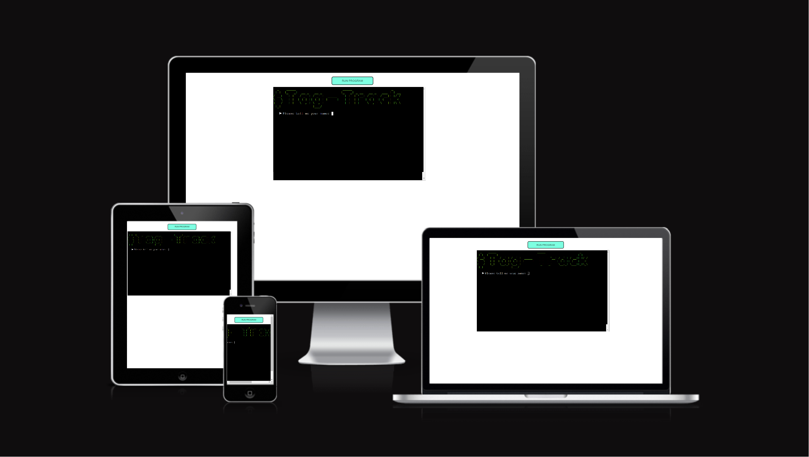
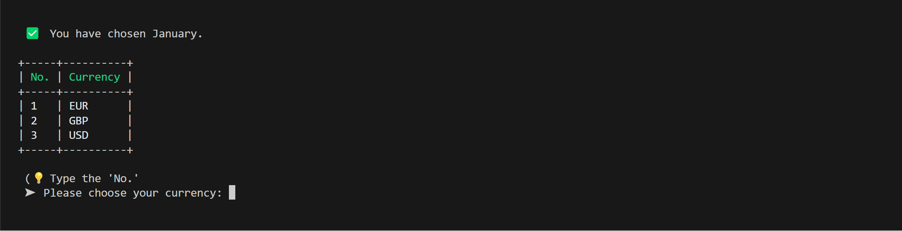
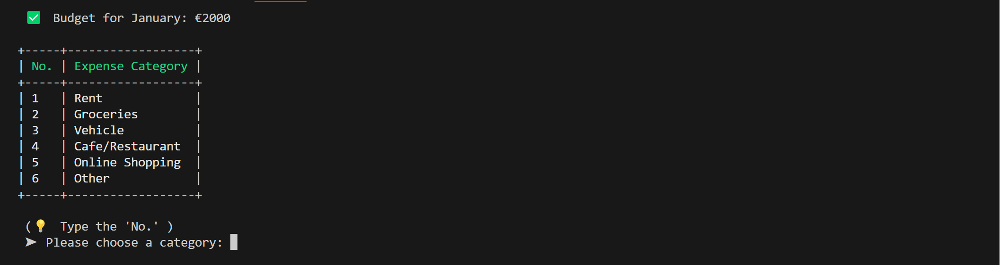
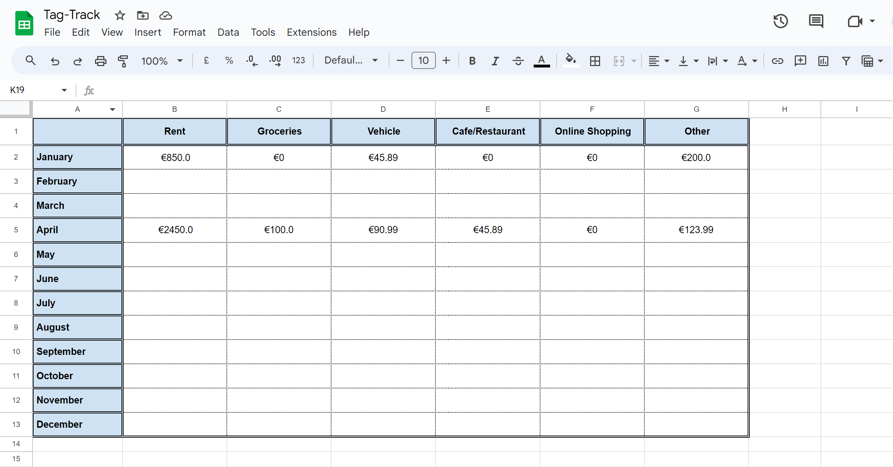

# Tag Track
This app enables users to monitor their monthly spending through predefined budgets and provides a yearly 'overview' sheet for a comprehensive view. It offers various categories for users to systematically record their expenses (defined in _Structure_). Once expenses are logged, users can access a summary of their monthly spendings in a Google Sheets format.

The application is available for viewing [here](https://tag-track-cc45575f1826.herokuapp.com/).

The Google Sheets for this application is available for use [here](https://docs.google.com/spreadsheets/d/1kGdwNqPvyRYIRL4LbEy-CgS1YDIHI6uKYHOG7gMbuB8/edit#gid=1925370965).

# Business/Social Goals
- Develop a user-friendly and efficient expense tracking tool to assist users in refining their spending behavior.
- Generate an immediate summary table that displays the user's expenditure records and available budget.
- Establish a Google Sheet as a repository for all recorded expenses, allowing users to review their spending history on:
    - a _monthly_ basis.
    - a _yearly_ basis.

# User Stories
- As a first time user, I need an intuitive and easy-to-understand interface. 
- As a first time user, I need clearly defined and easy-to-follow instructions for using the application.
- As a first time user, I want the ability to quickly select options and enter my expenses.
- As a first time user, I expect immediate feedback on my entries, with an option to easily exit and restart in case of errors.
- As a first time user, I prefer having a single view where my expenses and budget are logged together for personal analysis. This should include a remainder calculation after all of the expenses have been deducted from my budget. 

- As a regular user, I seek the capability to log multiple expenses simultaneously in different categories and see the total spent in each category.
- As a regular user, I need a visual cue to indicate when my spending exceeds my monthly budget.
- As a regular user, I desire a monthly expense record for future reference in a recognisable and legible format.

# UX Goals
Due to the solely-backend nature of this project, enhanecement strategies for the UI's visual appeal are limited. Nonetheless:

- Design a well-structured terminal interface that utilizes spacing effectively for optimal readability.
- Clear the terminal screen after each significant input to avoid visual littering and focus attention towards input validation and the next step.
- Implement distinct headings where suitable, to differentiate them from regular text, preferably using colour or table header elements.
- Use emojis and icons to signify different input requirements. 
- Use spacing where appropriate (_\n_) or (_tab_) to offset elements from each other/ edge of the terminal. 

# Structure 
The structure of the 'Tag Track' application is as follows: 

## Terminal Face
- Title
- Name input prompt with validation
- Month input prompt (number list) with validation
- Currency input prompt with validation
    - EUR
    - GBP
    - USD
    - AUD
    - PLN
- Total Monthly Budget input prompt with validation
    - Or budget retrieval system based on the user's month selection. 
- _Press 'Enter' to Continue OR Type 'q' to quit..._
- List of Categorised Expenses
    - Rent
    - Groceries
    - Vehicle
    - Cafe/Restaurant
    - Online Shopping
    - Other
- Category Input prompt with validation
- Expense input prompt with validation
- Visual Appendage in the form of a table with relevant budget calculation
- _Press 'u' to upload expenses to Google Sheets OR Type 'q' to quit..._

# Scope of Application
The purpose of the application is to gather expense data from the user and input this information into Google Sheets as individual rows. Google Sheets serves as a reference and as a recognisable and legible format in which the user may review their expenses, and see their annual spendings. 

The scope of this application is as follows: 
1. Name input with validation (to personalise the experience).

2. Choice of month with validation and confirmation prompt, essential as the app works on a monthly framework for budgeting and final tallies. Users can select a month numerically (e.g., 1 for January, 2 for February), with a confirmation step to prevent accidental selections. The chosen month appears as a heading in both Google Sheets and the terminal table.

3. Currency selection with validation. 

4. Monthly Budget Input - later transferred to Google Sheets as data for calculation. If expenses were previosuly logged for the user's chosen month, the application retrieves the budget and prompts the user whether they wish to use the existing budget or amend it. 

5. Several _'Enter' to continue_, or _'q' to quit_ prompts for user comfort. 

6. A list of expense categories, aiding users in organized entry of expenses. These categories also help in sorting expenses in Google Sheets and are used for generating expense totals in each category for each month in the annual _Overview_ sheet.

7. After entering expenses, the application automatically calculates and displays the total monthly expenses per category. This feature helps users understand their spending patterns and notice any imbalances.

8. A prompt to ask whether users would like to upload their expenses to Google sheets into organised month spreads. This is the final step and serves as a reference directory for the user should they wish to review or amend their spendings at a later stage. 

# Strategy
The aim of the application is to provide an easy-to-use and interactive platform for monitoring expenses within a budget framework. Users can track their spending against a monthly budget and have the flexibility to check their remaining balance, whether it's in surplus or deficit, at any time. Through Tag Tracker, users gain insights into their spending patterns, identify which months incur higher expenses, and adjust their spending behavior accordingly.

## Target Audience
- Anyone aged 16+ yrs.
- Anyone who would like to impove their spending habits.

## Key Information Deliverables
- Easy-To-Use Interface
- Visual Expense Tracking and Logging Confirmation
- Category Selection
- Expense Input
- Conclusive User Table with Expenses and Budget Remainder
- Google Sheets Logging and Calculations

## Visual Simplicity
- To enhance readability, spaces will be included at the start of sentences, distancing them from the terminal's edge.
- Colors will be used judiciously to distinguish various pieces of information, thereby improving their legibility.
- Icons/emojis will be used to signify the intent of prompts, key pieces of information, warnings, and tips. 

- On Google Sheets, each month and the final overview sheet will be set as a separate spread, so users have concise, separate areas in which to view their expenses. 

# Wireframes & FlowChart
Below is the flowchart for the application. Noted is the general flow of the application, the user story, and several validations with ValueError considerations and decision flows. 

# Aesthetics
### Colour
Color plays a key role in the tag-tracker interface, with specific hues chosen for their significance and legibility. The title of the tag-tracker and the headers of all tables feature green, a color universally linked with finance and money. Green is also chosen for its high legibility in the colorama Python library, making it a suitable choice.

For instances where a user exceeds their monthly budget, red is utilized in the final summary table to highlight the negative overdraft. In contrast, when the budget is not exceeded, the remaining balance is displayed in a darker shade of green, maintaining the financial theme.

The main reason for using colour in the application is to provide a somewhat engaging interface for the user, and to distinguish key pieces of text from the terminal face. 

### Emojis/Icons
Emojis/icons are used throughout the application to visually aid users in distinguishing prompt intents. A breakdown can be found below:

- ⚠️: signifies a checkpoint or warning message.
- ➤ : signifies an input prompt.
    - ❌ : failed validation.
    - 👉 : indicates the type of expected input.
    - ✅ : successful validation.
- 💡 : signifies insight/note/tip.
- ⌛ : signifies a pending request.
- 👋 : signifies exiting. 

# Features
### Month/Currency/Categories Choice
Users can choose a month for tracking their expenses from a numerical list. This selection process retrieves the corresponding monthly sheet from Google Sheets, along with any existing data relevant to that month. Later in the application, both the user's expenses and budget information are recorded onto the appropriate Google Sheet for that month, and calculations for total expenses are made for the corresponding month row in the overview sheet. 

Users are given the option to select from 5 different currencies to record their expenses. This feature integrates with the currencies Python library, enabling the display of corresponding currency symbols next to the users' expense and budget entries.

Users are given the option to select from 6 different categories to record their expenses. These categories represent columns in the month sheets, to which users can log their expenses. These same columns are replicated in the overview sheet, providing users with a detailed annual summary of their expenses across all categories.

Furthermore, for a bit of fun, the user's input validation is tweaked so that a valid input prints an informal message with the user's chosen category. The message for categories 1-2 is different to categories 3-5. Category 6 _'Other'_ does not have a message associated with it, but validation is provided in the input message. An example for 'Online Shopping' (No.5) is presented below. After input, users are asked whether they wish to log another expense, or go to the next step (the conclusive expense table).

The user may log several times for one category. If there is more than one expense log per category, the expenses are added together and the total is displayed in the conclusive user expense table and later logged to Google Sheets (if the user chooses to). 

### Budget Input
As mentioned, the user's month selection retrieves the corresponding Google Sheet with all relevant data already on it. This data includes a check for an existing budget previously logged by the user:

#### Existing Budget
If one exists, the user is prompted on whether they wish to continue with this budget, or update it to a new value. The input is then validated and the application proceeds according to the user's choice. 

In the first image below, there is an existing budget of 6000 euro for the month of January.

In the second image below, the user has selected to log for the month of January, the application detects an existing budget, displays it to the user, and asks the user whether they wish to continue with it or change its value.

#### No Budget
If there is no existing budget, the user is prompted to enter a budget for their chosen month. The input is validated and the user is either directed to the next step, or given a validation error with a tip on the type of input expected, and asked to re-enter their budget. 

### Conclusive User Table
The conclusive user table displays a summary of the user's logged expenses. The top row shows the Month and Budget. The next rows show the total spendings for each category, and the final row displays the budget remainder after all spendings were deducted. If the budget remainder is positive, the result is displayed in green. If the remainder has an overdraft, the result is displayed in red. 

### Google Sheets Logging + Overview Calculations
Under the conclusive user expense table, the user is asked whether they want to log their expenses to Google Sheets. If not, the application displays a goodbye message and does not log anything. If yes, the expenses are logged to Google Sheets and the overview sheet is automatically updated with new totals. 

# Technologies
- [gspread](https://pypi.org/project/gspread/) - for interacting with Google Sheets.
- Google Cloud Console - for Google Drive and Google Sheets APIs.
- [os](https://www.w3schools.com/python/module_os.asp) - for clearing the terminal face. 
- google.oauth2.service_account for Credentials.
- [art](https://pypi.org/project/art/) - for ASCII art.
- [colorama](https://pypi.org/project/colorama/) - for text colours. 
- [prettytable](https://pypi.org/project/prettytable/) - for tables.
- [termcolor](https://pypi.org/project/termcolor/) - used in title and heading colours. 
- [currencies](https://pypi.org/project/currencies/) - for currency symbols and conversions. 
- [amiresponsive](https://ui.dev/amiresponsive?url=https://tag-track-cc45575f1826.herokuapp.com/) - for the responsive png

# Testing & Debugging
#### Issues
There were a few issues while the project was being developed, having mostly to do with string, integer and float use cases. In the image below, you can see the user's conclusive table, in which the month, budget, and expenses are detailed. 

### Integer Number Bug

As in the current application, each category is detailed in a separate row. If the category was logged more than once by the user, the value of the expenses are added and appended to the existing category row. Before appending, the values are logged to a dictionary, detailing each of the individually logged expense values - and in one instance, as detailed in the _'Vehicle':'4324342'_ element. The issue is quite clear here - the expenses are pushed as strings and thus my attempt to add the values '432' and '432' resulted in '432432', instead of 864. This problem was fixed by converting the values into integers and then adding them (second image below, but with different values). 

Another more significant issue arose when trying to log values that had a decimal point as expenses, i.e. 69.99 for Online Shopping. Please see image below. 

### Float Number Bug

This would trigger my number validation function, which checked and returned if a given input isdigit(). This function was modified to instead check if a given input was a float, as this accepts both integer values (e.g., 20.0), and floats. Please see image below.

### Terminal Clear Bug

This error was encountered after implementing a function that would clear the terminal screen. While it worked as intended in the VSCode terminal, it threw the error shown above in the Heroku terminal. After some research [here](https://stackoverflow.com/questions/13384116/linux-console-cls-not-found-error), the reason for the bug was pinpointed being due to Heroku's Unix/Linux-like nature, whereas my function was designed only to handle terminal clearing on a Windows operating system. The first iteration of the function is shown below, with the improved version after it. 

### Debugging

# Accessibility & Performance

# Deployment

# Future Development

# Credits
- [Currencies](https://pypi.org/project/currencies/) (Research and two lines of logic).
- [How to Use gspread](https://docs.gspread.org/en/latest/user-guide.html)
- [Convert Num to Letter (stack overflow)](https://stackoverflow.com/questions/18544419/how-to-convert-numbers-to-alphabet)
- [Clear os screen](https://www.scaler.com/topics/how-to-clear-screen-in-python/)