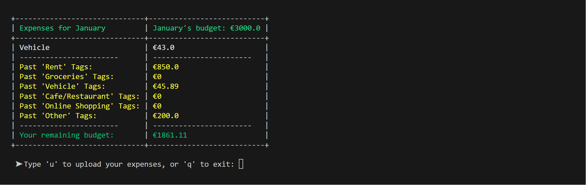
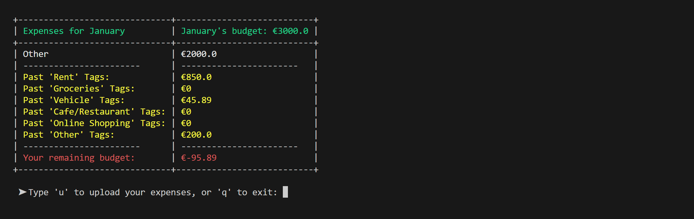
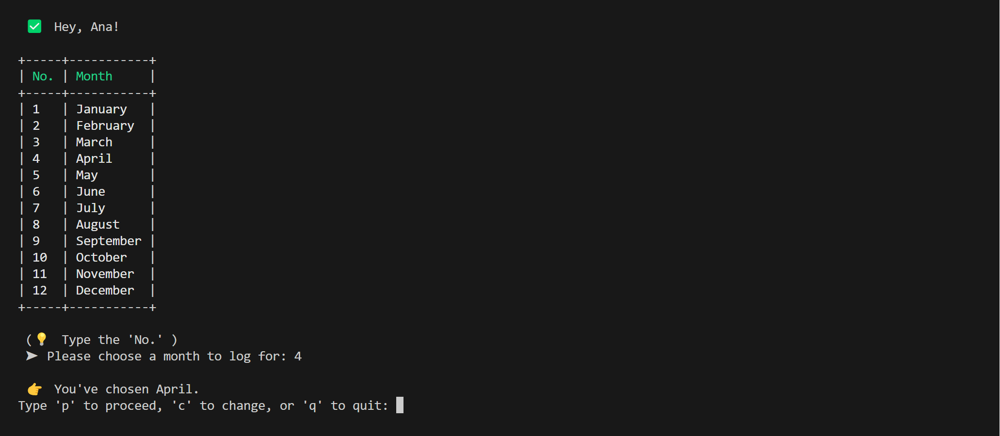
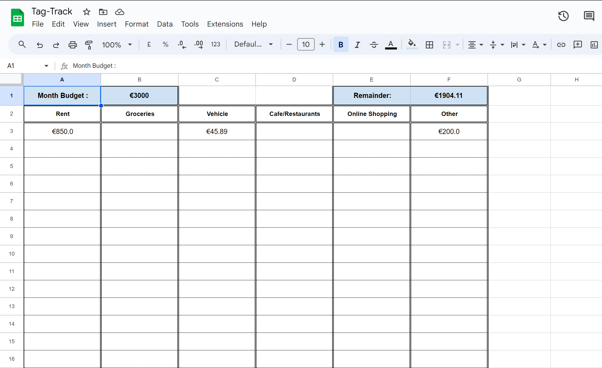
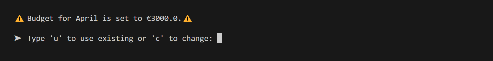
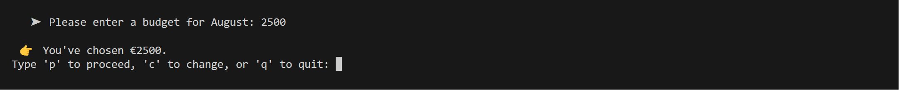

# Tag Track
This app enables users to monitor their monthly spending through predefined budgets and provides a yearly 'overview' sheet for a comprehensive view. It offers various categories for users to systematically record their expenses (defined in _Structure_). Once expenses are logged, users can access a summary of their monthly spendings in a Google Sheets format.

The application is available for viewing [here](https://tag-track-revived-46181e706d13.herokuapp.com/).

The Google Sheets for this application is available for use [here](https://docs.google.com/spreadsheets/d/1kGdwNqPvyRYIRL4LbEy-CgS1YDIHI6uKYHOG7gMbuB8/edit#gid=1925370965).

# Business/Social Goals
- Develop a user-friendly and efficient expense tracking tool to assist users in refining their spending behavior.
- Generate an immediate summary table that displays the user's expenditure records and available budget.
- Establish a Google Sheet as a repository for all recorded expenses, allowing users to review their spending history on:
    - a _monthly_ basis.
    - a _yearly_ basis.

# User Stories
- As a first time user, I need an intuitive and easy-to-understand interface. 
- As a first time user, I need clearly defined and easy-to-follow instructions for using the application.
- As a first time user, I want the ability to quickly select options and enter my expenses.
- As a first time user, I expect immediate feedback on my entries, with an option to easily exit and restart in case of errors.
- As a first time user, I prefer having a single view where my expenses and budget are logged together for personal analysis. This should include a remainder calculation after all of the expenses have been deducted from my budget. 

- As a regular user, I seek the capability to log multiple expenses simultaneously in different categories and see the total spent in each category.
- As a regular user, I need a visual cue to indicate when my spending exceeds my monthly budget.
- As a regular user, I desire a monthly expense record for future reference in a recognisable and legible format.
- As a regular user, I want the option of being able to log my expenses in multiple currencies.

# UX Goals
Due to the solely-backend nature of this project, enhanecement strategies for the UI's visual appeal are limited. Nonetheless:

- Design a well-structured terminal interface that utilizes spacing effectively for optimal readability.
- Clear the terminal screen after each significant input to avoid visual littering and focus attention towards input validation and the next step.
- Implement distinct headings where suitable, to differentiate them from regular text, preferably using colour or table header elements.
- Use emojis and icons to signify different input requirements. 
- Use spacing where appropriate (_\n_) or (_tab_) to offset elements from each other/ edge of the terminal. 

# Structure 
The structure of the 'Tag Track' application is as follows: 

- Title
- Name input prompt with validation
- Month input prompt (number list) with validation
- Retrieval of any existing budget/ budget remainder
    - + option of using the values or changing them
- Currency input prompt with validation
    - EUR
    - GBP
    - USD
- Total Monthly Budget input prompt with validation
    - Or budget retrieval system based on the user's month selection. 
- List of Categorised Expenses
    - Rent
    - Groceries
    - Vehicle
    - Cafe/Restaurant
    - Online Shopping
    - Other
- Category Input prompt with validation
- Expense input prompt with validation
- Visual Appendage in the form of a table with relevant budget calculation
- _Press 'u' to upload expenses to Google Sheets OR Type 'q' to quit..._
- Ability to _quit_ at each input prompt

# Scope of Application
The purpose of the application is to gather expense data from the user and input this information into Google Sheets as individual rows. Google Sheets serves as a reference and as a recognisable and legible format in which the user may review their expenses, and see their annual spendings. 

The scope of this application is as follows: 
1. Name input with validation (to personalise the experience).

2. Choice of month with validation and confirmation prompt, essential as the app works on a monthly framework for budgeting and final tallies. Users can select a month numerically (e.g., 1 for January, 2 for February), with a confirmation step to prevent accidental selections. The chosen month appears as a heading in both Google Sheets and the terminal table.

3. Budget and Budget Remainder retrieval. After selecting a month, the application checks for any existing values in cells 'B1' - Month Budget, and 'F1' - Month Remainder. If found, prompts the user whether they wish to use these values or change them. If the user selects to use - the application jumps to category selection for expense logging. Else, continues to currency selection. 

4. Currency selection with validation. 

5. Monthly Budget Input - later transferred to Google Sheets as data for calculation.

6. User inputs are confirmed with _Type 'p' to proceed, 'c' to change, or 'q' to quit:_. The input accepts lower and uppercase letters, and applies logic accordingly. 

7. A list of expense categories, aiding users in organized entry of expenses. These categories also help in sorting expenses in Google Sheets and are used for generating expense totals in each category for each month in the annual _Overview_ sheet.

8. After entering expenses, the application automatically calculates and displays the total monthly expenses per category. This feature helps users understand their spending patterns and notice any imbalances. If the user had previously changed their desired currency from the one the application logged the budget remainder onto Google Sheets, changes in value are applied accordingly and the correct value is returned (subject to Currency Rates from Forex-Python).

9. A prompt to ask whether users would like to upload their expenses to Google sheets into organised month spreads. This is the final step and serves as a reference directory for the user should they wish to review or amend their spendings at a later stage. The application displays a goodbye message after everything has been uploaded and exits. 

# Strategy
The aim of the application is to provide an easy-to-use and interactive platform for monitoring expenses within a budget framework. Users can track their spending against a monthly budget and have the flexibility to check their remaining balance, whether it's in surplus or deficit, at any time. The application is flexible with currencies (at the moment supporting either 'EUR', 'GBP', and 'USD'), and applies all relevant changes to remainder value accordingly. Through Tag Tracker, users gain insights into their spending patterns, identify which months incur higher expenses, and adjust their spending behavior accordingly.

## Target Audience
- Anyone aged 16+ yrs.
- Anyone who would like to impove their spending habits.

## Key Information Deliverables
- Easy-To-Use Interface
- Visual Expense Tracking and Logging Confirmation
- Category Selection
- Expense Input
- Conclusive User Table with Expenses and Budget Remainder
- Google Sheets Logging and Calculations

## Visual Simplicity
- To enhance readability, spaces will be included at the start of sentences, distancing them from the terminal's edge.
- Colors will be used judiciously to distinguish various pieces of information, thereby improving their legibility.
- Icons/emojis will be used to signify the intent of prompts, key pieces of information, warnings, and tips. 

- On Google Sheets, each month and the final overview sheet will be set as a separate spread, so users have concise, separate areas in which to view their expenses. 

# Wireframes & FlowChart
Below is the flowchart for the application. Noted is the general flow of the application, the user story, and several validations with ValueError considerations and decision flows. 

# Aesthetics
### Colour
Color plays a key role in the tag-tracker interface, with specific hues chosen for their significance and legibility. The title of the tag-tracker and the headers of all tables feature green, a color universally linked with finance and money. Green is also chosen for its high legibility in the colorama Python library, making it a suitable choice.

For instances where a user exceeds their monthly budget, red is utilized in the final summary table to highlight the negative overdraft. In contrast, when the budget is not exceeded, the remaining balance is displayed in a darker shade of green, maintaining the financial theme.

The main reason for using colour in the application is to provide a somewhat engaging interface for the user, and to distinguish key pieces of text from the terminal face. 

### Emojis/Icons
Emojis/icons are used throughout the application to visually aid users in distinguishing prompt intents. A breakdown can be found below:

- ⚠️: signifies a checkpoint or warning message.
- ➤ : signifies an input prompt.
    - ❌ : failed validation.
    - 👉 : indicates the type of expected input.
    - ✅ : successful validation.
- 💡 : signifies insight/note/tip.
- ⌛ : signifies a pending request.
- 👋 : signifies exiting. 

# Features
### Month/Currency/Categories Choice
Users can choose a month for tracking their expenses from a numerical list. This selection process retrieves the corresponding monthly sheet from Google Sheets, along with any existing data relevant to that month. Later in the application, both the user's expenses and budget information are recorded onto the appropriate Google Sheet for that month, and calculations for total expenses are made for the corresponding month row in the overview sheet. 

Users are given the option to select from 3 different currencies to record their expenses. This feature integrates with the currencies Python library, enabling the display of corresponding currency symbols next to the users' expense and budget entries. Forex-python is used for converting values from one currency to another, e.g., for the logic calculating budget remainder.

Users are given the option to select from 6 different categories to record their expenses. These categories represent columns in the month sheets, to which users can log their expenses. These same columns are replicated in the overview sheet, providing users with a detailed annual summary of their expenses across all categories.

After input, users are asked whether they wish to log another expense, or go to the next step (the conclusive expense table).

The user may log several times for one category. If there is more than one expense log per category, the expenses are added together and the total is displayed in the conclusive user expense table and later logged to Google Sheets (if the user chooses to). 

Note: This image does not relate to the path followed through the application as it was taken at a later stage, but the journey and logic remains the same.

### Budget Input
As mentioned, the user's month selection retrieves the corresponding Google Sheet with all relevant data already on it. This data includes a check for an existing budget previously logged by the user:

#### Existing Budget
If one exists, the user is prompted on whether they wish to continue with this budget, or update it to a new value. The input is then validated and the application proceeds according to the user's choice. 

In the first image below, there is an existing budget of 6000 euro for the month of January.

In the second image below, the user has selected to log for the month of January, the application detects an existing budget, displays it to the user, and asks the user whether they wish to continue with it or change its value.

Note: This image does not relate to the path followed through the application as it was taken at a later stage, but the journey and logic remains the same.

#### No Budget
If there is no existing budget, the user is prompted to enter a budget for their chosen month. The input is validated and the user is either directed to the next step, or given a validation error with a tip on the type of input expected, and asked to re-enter their budget. 

### Conclusive User Table
The conclusive user table displays a summary of the user's logged expenses. The top row shows the Month and Budget. The next rows show the total spendings for each category, and the final row displays the budget remainder after all spendings were deducted. If the budget remainder is positive, the result is displayed in green. If the remainder has an overdraft, the result is displayed in red. 

### Google Sheets Logging + Overview Calculations
Under the conclusive user expense table, the user is asked whether they want to log their expenses to Google Sheets. If not, the application displays a goodbye message and does not log anything. If yes, the expenses are logged to Google Sheets and the overview sheet is automatically updated with new totals.

Below is an example after the user has been logging expenses over the course of a few months. Expenses are added up and logged to the overview sheet. In the case of cell 'F2' - where the currency differs from the rest, the user had logged only one expense, the currency of 'GBP'. This means that any existing value for that category was converted to 'GBP', prior to having the new expense added onto it and logged.

# Technologies
- [gspread](https://pypi.org/project/gspread/) - for interacting with Google Sheets.
- Google Cloud Console - for Google Drive and Google Sheets APIs.
- [os](https://www.w3schools.com/python/module_os.asp) - for clearing the terminal face. 
- google.oauth2.service_account for Credentials.
- [art](https://pypi.org/project/art/) - for ASCII art.
- [colorama](https://pypi.org/project/colorama/) - for text colours. 
- [prettytable](https://pypi.org/project/prettytable/) - for tables.
- [termcolor](https://pypi.org/project/termcolor/) - used in title and heading colours. 
- [currencies](https://pypi.org/project/currencies/) - for currency symbols and conversions. 
- [amiresponsive](https://ui.dev/amiresponsive?url=https://tag-track-cc45575f1826.herokuapp.com/) - for the responsive png
- [Code Beautify](https://codebeautify.org/python-formatter-beautifier) - for beautifying my Python Code.
- [CI Python Linter](https://pep8ci.herokuapp.com/) - for detecting lint in my code.

# Testing & Debugging

| Feature | Expected Outcome | Testing Procedure | Result | Remark |
|----------|----------|----------|----------|----------|
| Intro   | Print? Ask Name?   | Click 'Run Program' | Heading prints as expected, asks Name |    |
| Name Input  | Loop until Validated? Month input?   | Inputs: '', 'ana43', '35', 'ana'   | Loops until validated ('ana') with appropriate error messages, greeting with capitalised Name, asks Month |  |
| Month Input   | Loop until Validated? Currency choice?   | Inputs: '', letters, numbers > 12, '1' | Loops until validated ('1') with appropriate error messages, asks Currency   |  |
| Budget Retrieval   | Retrieve Existing Budget? Display? Give option to proceed or change? Loop Validation? Ask Currency if no Existing?   | Check for existing budget on Tag-Track Google Sheets, Inputs: 'w', 'c', 'p' | Retrieves and Displays Correct Budget, Loops until validated (both 'c' to change, then 'p' to proceed), If none exists - asks for Budget, Displays Category Choice |  |
| Procedure Check in! | 'p' to proceed, 'c' to change - re-plays previous feature, 'q' to exit | Inputs: '', 'g', '4', 'p', 'c', 'q' (at different intervals)  | Loops until validated ('p') with appropriate error messages, proceeds to next feature, 'c' allows the user to change their input, 'q' exits the application |  |
| Currency Choice   | Loop until Validated? Exit Check? | Inputs: '', letters, numbers > 3, '1' | Loops until validated ('1') with appropriate error messages, proceeds to next Check |  |
| Currency Symbol + Formatting | Return Correct Symbol on Expense? | Choose Currency, Visual Check on confirmation msg, budget format + expenses format later | Correctly Returns Formatted Expense |  |
| Category Choice | Loop until Validated? Expense Input Prompt? | Inputs: '', letters, numbers > 6, '2' | Loops until validated ('2') with appropriate error messages, proceeds to Expense Input |  |
| Expense Input | Loop until Validated? Take Float? Expense Check? | Inputs: '', letters, '103.56' | Loops until validated ('103.56') with appropriate error messages, proceeds to Expense Check |  |
| Expense Check | Loop until Validated? Allow another Expense Entry? 'a', Continue to User Expense Table? 'c' | Inputs: '', 't', 'a', 'c' | Loops Until Validated, Allows another expense entry 'a' - (Category Choice, then Expense Input Prompt), Continues to User Expense Table - 'c' |  |
| Correct Remainder Calculation | Display: Correct Remainder Value? Correct Symbol Appendage? | Manual Addition/Subtraction + Comparison, Visual Check for Symbol + Colour if negative/positive value of remainder | Displays all Values + Correct Colours for negative/positive budget remainder |  |
| User Expense Table | Display: Budget? Correct Values including Addition of Same-Category Expenses? Remainder in Colour?, Upload/Exit Check? | Manual Addition/Subtraction + Comparison | Displays all Values + Correct Colours for negative/positive budget remainder |  |
| Upload/Exit Check | Loop until Validated? Upload ('u') or Exit ('q')? | Inputs: '', 't', 'u', | Loops until validated, Uploads + Displays Success Msg, and/or Exits on 'q' |  |

## Python Linter
After running the code through [Code Beautify](https://codebeautify.org/python-formatter-beautifier), the Code Institute Python Linter picked up on 3 unique errors: 

-  E501 line too long (103 > 79 characters)
-  E711 comparison to None should be 'if cond is None
-  E712 comparison to False should be 'if cond is False

The first is due to personal oversight, and was immediately corrected where the problem was highlighted. 

The latter two were due a mix up of syntax between JS and Python, and were ammended. 

A full overview can be seen below:

After fixing all issues highlighted by the linter, the code was run through the linter again, yielding no errors: 

Note: This image reflects a more recent version of the code, which has undergone significant development compared to the initial image. To ensure code quality, it was thoroughly checked with a linter multiple times to identify and correct any issues. The image was captured prior to the final submission of the code. Any encountered errors were noted to be the same three issues, as outlined in the table below.

| Issues | Fixes |
|----------|----------|
| E501 line too long (x > 79 characters) | This issue was fixed by using """ """ for multi-row strings, and by concisely rewording |
| E711 comparison to None should be 'if cond is None | By changing '==' to 'is' |
| E712 comparison to False should be 'if cond is False | By changing '==' to 'is' |

## Issues
There were a few issues while the project was being developed, having mostly to do with string, integer and float use cases. In the image below, you can see the user's conclusive table, in which the month, budget, and expenses are detailed. 

### Integer Number Bug

As in the current application, each category is detailed in a separate row. If the category was logged more than once by the user, the value of the expenses are added and appended to the existing category row. Before appending, the values are logged to a dictionary, detailing each of the individually logged expense values - and in one instance, as detailed in the _'Vehicle':'4324342'_ element. The issue is quite clear here - the expenses are pushed as strings and thus my attempt to add the values '432' and '432' resulted in '432432', instead of 864. This problem was fixed by converting the values into integers and then adding them (second image below, but with different values). 

Another more significant issue arose when trying to log values that had a decimal point as expenses, i.e. 69.99 for Online Shopping. Please see image below. 

### Float Number Bug

This would trigger my number validation function, which checked and returned if a given input isdigit(). This function was modified to instead check if a given input was a float, as this accepts both integer values (e.g., 20.0), and floats. Please see image below.

### Terminal Clear Bug

This error was encountered after implementing a function that would clear the terminal screen. While it worked as intended in the VSCode terminal, it threw the error shown above in the Heroku terminal. After some research [here](https://stackoverflow.com/questions/13384116/linux-console-cls-not-found-error), the reason for the bug was pinpointed being due to Heroku's Unix/Linux-like nature, whereas my function was designed only to handle terminal clearing on a Windows operating system. The first iteration of the function is shown below, with the improved version after it. 

### Currency Conversion Value Bug

After running a conversion from one currency to another using the same values, the conversion values showed differences on average of .40 in several instances. This issue was likely due to the way the program was designed, where the user's logged expenses were not correctly rounded to 2 decimals.

## API Issue
A _RatesNotAvailableError_ issue with the python-forex library for currency conversion was discovered on 17/02/24 once the application was nearing completion. This issue was due to the [ratesapi.io](https://forex-python.readthedocs.io/en/latest/currencysource.html) being temporarily unavailable. Due to this issue and the project's nearing deadline, a decision was made to remove currency selection from the project - rendering much of its functionality described previously in this README obsolete. 

This issue was highlighted in the library's repository in the 'issues' tab, and upon further investigation, it appears the API is taken down regularly for maintenance. Below is an image of correspondence for reference. This exchange is available for viewing [here](https://github.com/MicroPyramid/forex-python/issues/153).

It is my intention to re-encorporate this logic into the application through the original API source following course completion. 

# Accessibility & Performance
This application was developed using VSCode's Pylance; a fast and feature-rich language server for Python that provides excellent IntelliSense capabilities. It enhances your development experience with: Type checking. Autocompletion.

# Deployment
Please Note: The guide below details the steps in accordance with the original application deployment titled 'tag-track', however due to some billing issues the application fell asleep (as can be seen from the third image below) and later faded into a lighter purple. The application is now deployed using 'tag-track-revived', with the exact same steps. 

### General Requirements:
- Your Python code must be placed in the `run.py` file.
- Your dependencies must be placed in the `requirements.txt` file.

### General Word of Advice:
- Take caution if editing any of the other files or your code may not deploy properly.

## Creating the Heroku app

### Step 1: Create an App on Heroku

- Log onto your Heroku dashboard.

 

- Set Up an authenticator for two-factor verification. I chose Google Authenticator because I already had it pre-installed on my phone. 

 - Create a new app as shown in the image below:

You will be asked to pick a name for your app, and select a region, before clicking _Create app_ on the next page.

### Step 2: Connect to GitHub

- Once you've created your app, go to the _Deploy_ tab at the top. 

_Note: For demonstration purposes, I created a new app called 'gkggfk', but the process is the same everywhere._
- Select the middle box with GitHub's logo to connect your Heroku app to a Github Repository. 
- If prompted, authorize Heroku to access your GitHub account.
- At the bottom, enter the name of the repository you wish to deploy to, and click _Connect_.

### Step 3: Automatic Deploy (Optional)

- Under the "Automatic deploys" section, choose a branch from your GitHub repository that Heroku will watch for changes.

- Enable automatic deploys by clicking _Enable Automatic Deploys._ With this, every push to the selected branch will automatically deploy a new version of your app.

### Step 4: Extra Important Steps

When you create the app, you will need to add two buildpacks from the _Settings_ tab. The ordering is as follows:

1. `heroku/python`
2. `heroku/nodejs`

You must then create a _Config Var_ called `PORT`. Set this to `8000`

If you have credentials, you must create another _Config Var_ called `CREDS` and paste the relevant JSON into the value field.

### Step 5: Deploy Your Masterpiece

- If you've enabled automatic deploys, any push to the selected branch will automatically deploy your application.

- If you prefer to deploy manually or want to deploy a branch without enabling automatic deploys, go to the "Manual deploy" section, select the branch, and click "Deploy Branch."

### Step 6: Where is my Application?

Your application has a similar look to the following Heroku URL: (https://<your-app-name>.herokuapp.com), and can be found after clicking the _Open App_ button on your dashboard in the top right. 

## Constraints

The deployment terminal is set to 80 columns by 24 rows. That means that each line of text needs to be 80 characters or less otherwise it will be wrapped onto a second line.

## Forking a Github Repository

To changes to your repository (or part of it) without affecting it's original state, you can 'fork' it (make a copy of it). This ensures the original repository remains unchanged. To fork a github repository, follow the following steps:

- Click into the github repository you want to fork.
- Click 'Fork' in the top right hand side of the top bar, and this should take you to a page titled 'Create a new fork'.
- You can now work in this copy of your repository without it affecting the original.

## Cloning a Github Repository

- Cloning a repository essentially means downloading a copy of your repository that can be worked on locally. This method allows for version control and back up of code. To clone a github repository, follow the following steps:

- Click into the github repository you want to clone.
- Press the 'Code' button. This should open a section similar to the one below. 

- Copy the link in this dropdown
- Open a terminal within your VSC (or whatever IDE you choose to use).
- In the terminal type 'git clone' and paste the URL.
- Press Enter - you now have a cloned version of your github repository.

# Future Development

### API Currency Conversions
Since the API crashed, I've had to remove some core logic from the application. It is my intention to re-encorporate it back into the application following course completion. The original code as it is from this commit message has been forked into a private repository for reference at a later stage. 

Integrate more accurate Currency Conversions - when comparing forex-python rates with those from a quick google search, there appears to be a mismatch averaging around 20 units. I would like to incorporate some sort of API to handle this conversion for more accurate, real-time results. 

### Overview Sheet
It is my intention to develop the overview sheet to log all expenses for one month in the same currency. As things stand, only the category that gets an expense logged to it in a different currency is updated, whereas the entire month sheet gets it's values converted. This functionality was being developed when the currency conversion API crashed. 

# Credits
- [Currencies](https://pypi.org/project/currencies/) (Research and two lines of logic).
- [Emojis](https://emojipedia.org/smirking-face)
- [How to Use gspread](https://docs.gspread.org/en/latest/user-guide.html)
- [Convert Num to Letter (stack overflow)](https://stackoverflow.com/questions/18544419/how-to-convert-numbers-to-alphabet)
- [Clear os screen](https://www.scaler.com/topics/how-to-clear-screen-in-python/)
- [gspread.exceptions.WorksheetNotFound](https://snyk.io/advisor/python/gspread/functions/gspread.exceptions.WorksheetNotFound)
- [screen recorder for README.md video files](https://www.screencapture.com/)
- [pypi.org for currency conversion example](https://pypi.org/project/currencies/)
-[snyk.io for Worksheet.NotFound](https://snyk.io/advisor/python/gspread/functions/gspread.exceptions.WorksheetNotFound)
- [Code Beautify for beautifying my python code](https://codebeautify.org/python-formatter-beautifier)
- [CI Python Linter](https://pep8ci.herokuapp.com/)
- [Forex Python for Currency Conversion](https://forex-python.readthedocs.io/en/latest/usage.html)

# Acknowledgements
As always, big thank you to Harry Dhillon for mentoring me ☺️